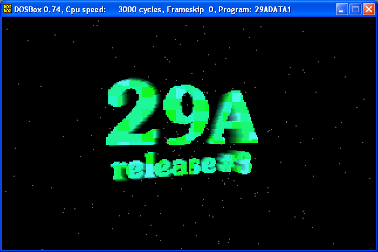

# 29A Issue # 3
```
29A#3.1_1 Editorial
29A#3.1_2 Introduction					Darkman
29A#3.1_3 News						Darkman
29A#3.1_4 Membership					Darkman
29A#3.1_5 Distribution					Darkman
29A#3.1_6 Our greetings					29A staff
29A#3.1_7 Policies and goals				Darkman
29A#3.1_8 Secret area					Darkman
29A#3.1_9 About the viewer				Darkman
29A#3.1_A Mister Sandman's resignation			MrSandman
29A#3.1_B Rajaat's resignation				Rajaat


Articles
29A#3.2_1 Archive32					CD13
29A#3.2_2 Billy Belcebu virus writing guide		Billy Belcebu
29A#3.2_3 Win32 PE infection tutorial			Qozah
29A#3.2_4 Pass to Ring-0 with C/C++			Sopinky
29A#3.2_5 The VxDCall backdoor				GriYo
29A#3.2_6 How to get the Windoze directory		Reptile
29A#3.2_7 Cross infection part I			Reptile
29A#3.2_8 Cross infection part II			VicodinES
29A#3.2_9 Heuristics for antivirus/archiving		Rajaat
29A#3.2_A Polymorphism					Rajaat
29A#3.2_B Preserving Novell Netware compatibility	Rajaat
29A#3.2_C TbScan32 decryptor				Rajaat
29A#3.2_D Nick Fitzgerald				Rajaat
29A#3.2_E Antivirus pathetism				Wintermute
29A#3.2_F JQwerty's compression/encryption engine	Jacky Qwerty
29A#3.2_G TbMem exploit					Darkman


Utilities
$UPD v2.2	$pirit
Error Correction Code (ECC)	Kala-Marai
Adinf/AVP Inspector CRC	Zhengxi
AVP Add-on	Z0MBiE
AVPX v1.01	Z0MBiE
AZCME v0.04	Z0MBiE
AZCME32 v0.04	Z0MBiE
STRC v1.0	Super
JQCODING v1.0	Jacky Qwerty
Tiny engines	Dark Cobra & Rajaat
APME v1.04b disassembled	Darkman
RDAE v1.0	Darkman


Windows
Win.Bonk	Vecna
Next Step	Quantum
Win95.K32	nIgr0
Win95.Z0mbie-II	Z0MBiE
Win95.Marburg	GriYo
Win95.HPS	GriYo
Win95.Bonk32	Vecna
Win95.Inca	Vecna
Win95.Sexy	Super
Win95.Yabram	SoPinKy
Win32.Apparition	LordAsd
Win32.Borges	Int13h
Win32.REDemption	Jacky Qwerty
VxD infector	Z0MBiE


Viruses
Califax	SVAT
RISC_OS.Simple	Dark Lord
Nutcracker.7458	Lord Nutcracker
Kuarahy v1.1	Int13h
Idea.6126	Spanska
Dark Thoughts v1.20	Anaktas
La Diosa	Nigromante
Widowmaker v1.02	ED-209/Immortal Riot
Soulfly	T-2000
Candyman	T-2000
Messev	T-2000
Gwar v1.10	T-2000
Squatter v1.2	Mental Driller
Claudia.8772 disassembled	Darkman & MrSandman
Pusher.374 disassembled v 2.0	Darkman


More viruses
007JB v1.01.2b	Z0MBiE
FIRE v1.00b	Z0MBiE
M1 [i286]	Z0MBiE
PGPMorph family	Z0MBiE
Zombie.667	Z0MBiE
Fick Nitzgerald	Rajaat
Weird Al	Rajaat
DSA2	Rajaat
Shiver	ALT-F11
Strange Days	Reptile
Numbless	Jacky Qwerty
Ancev	Vecna
Nutmeg2	Vecna
Ithaqua	Wintermute
Tiny viruses	Vecna, Super & Darkman
Ida.1490 disassembled	Darkman

```



