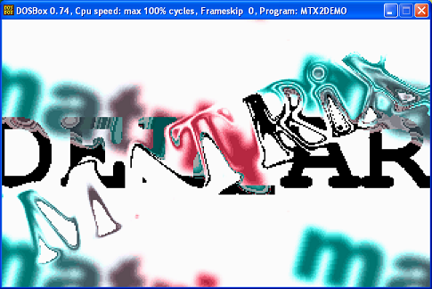

# MATRiX e-zine II - August 2000

## Editional
     [MATRiX]#2 zine
     greetz by ULTRAS
     greetz by Del_Armg0
     greetz by Anaktos
     greets by m0rtimer

## Interviews
     Interview with Lifewire by ULTRAS
     Interview with doctorL by Del_Armg0

## Articles
     W0rd infecion by ULTRAS
     Infection INF file part II by ULTRAS
     HTML Infection by ULTRAS
     A .pif Viral Tutorial by Del_Armg0
     PIF Format by Del_Armg0
     SCRIPT INFECTION - UNDER WIN/WAP by HenKy
     Entering Ring-0 Using Win32 Api: Context Modification by Z0MBiE
     METAMORPHISM by Z0MBiE
     Description of the win98/INT 2E services by Z0MBiE
     Writing into kernel from ring-3: lets fuck pagetable by Z0MBiE
     How Mirc send a file by DoxtorL. /[T.I]
     Encryption, Scan Strings And You by UNKNOWN
     Asynchronous IO by mort
     Entrypoint obscuring by mort
     Interprocess communication by mort
     Visual payload by mort
     Synchronization by mort
     Toolhelp functions by mort
     Win32 VX tutorial by mort

## Virii
### Win9x
     133 by Z0MBiE
     DAMMIT by ULTRAS
     ETYMO-CRYPT by Black Jack
     Fabi by Vecna
     MATRIX by LifeWire
     ZOMBiE-7 by Z0MBiE
### Win32
     SABiA by [MATRiX]
     ZOMBiE-8 by Z0MBiE
     Mutt by ULTRAS
     worm.Elsa by Del_Armg0
     ls by mort
     Zelda by ULTRAS
     Kalamarai by Kalamarai
     MATRIX.817 by Lord Dark
     AID by mort
     Vampiro by Lord Dark
     ordy by mort
### DOS
     Carcass v1.01 by T-2000 / Immortal Riot
     Merlin by Lord Dark
     PIF worms by Del_Armg0
### MACRO
     JANY_2000 by Del_Armg0
     JANY.B by Del_Armg0

## Tools
     First-Section File Infector (VX Library) by Z0MBiE
     Ring 0 library by Z0MBiE
     APLIB disassembly by NBK
     Scripted File Format Analyser by Mister Dinam0xki
     LME32 version 1.0 by Lord Dark
     Stealth W9x process by Vecna
     Huffman Compression/Decompression Engine by ULTRAS
     ordinals for win32.ordy by mort
## Demo
     [MATRiX]#1 demo source by Z0MBiE

