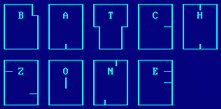

```
 ..................: BATCH ZONE :.....
:    interviews                       :
:.....................................:
:    articles                         :     BBBBBB ZZZZZZZ
:.....................................:     B   BBBZZZ   Z
:    viruses                          :     B     BZ     Z
:.....................................:     B     BZ   ZZZ
:    tutorials                        :     BBBBBBBZZZZZZZ
:.....................................:
:    constructors                     :  www.batch-zone.de.vu
:.....................................:
:    tools                            :
'.[DvL].[rRLF]........................'


  BBBBBB ZZZZZZZ  # #  555555
  B   BBBZZZ   Z ##### 5
  B     BZ     Z  # #  55555
  B     BZ   ZZZ #####      5
  BBBBBBBZZZZZZZ  # #   5555

  |_ Binaries
    |_ Games
      |_ Batch file chess 2.1
    |_Icons
    |_ Misc
      |_ ~vdx~man~
        |_ bat generator
      |_ Benji
        |_ UPX simple GUI
      |_ Duke
        |_ Simple Batch Virus Maker 0.01
        |_ Simple Batch Virus Maker 0.02d
      |_ DvL
        |_ Batch VCK 1.0
          |_ sample
        |_ Dangerous Menu 4.6
          |_ sample
        |_ Junk Remover 5.5
        |_ New bat & vbs 11.04.2004
      |_ Foley Hi-Tech Systems
        |_ Turbo Bat 3.10
      |_ Gr3v3
        |_ Tvirus
      |_ k3n
        |_ 65bitches 2.0
      |_ Kc3
        |_ BatchBatch WorkShop 1.0
      |_ krypt0nit3
        |_ sEcReT fOlDeR gEnErAtOr 1.0
      |_ Mark W. Geisinger
        |_ BatMenu 1.00
      |_ Rene Bollinger
        |_ BMenu 1.2
      |_ th3_L3D
        |_ The Fabulous Jany Batch Maker
      |_ Thomas Nyffenegger
        |_ Batsh 2.20
      |_ Unknown
        |_ 2new
        |_ Disk Space
        |_ Esc
        |_ Getboot
        |_ Input
        |_ MakeBat - TotalCMD plugin -
        |_ New Account Creator
        |_ Once a month
        |_ PortScan thru MS Dos
        |_ Prompts
      |_ wonderboy
        |_ e-razors
          |_ Microsoft Access
          |_ Microsoft Excel
          |_ Microsoft Media Player
          |_ Microsoft PowerPoint
          |_ RealOne Player
        |_ Exterminator 2.1
    |_ Virii
       |_ `Q` the misanthrope
         |_ WinStart 296
         |_ WinStart 297
       |_ 7c
         |_ Bat.Attrib.a
         |_ Bat.Attrib.b
         |_ Bat.Qomar
         |_ Bat.Remix
         |_ Bat.Spamacid
         |_ Bat.Vbs.Relax
         |_ Bat.Vbs.Relaxa
       |_ Black Wolf
         |_ Bat.Wagner
       |_ Duke
         |_ Bat.Telo
       |_ DvL
         |_ Bat.Blaster.b
       |_ Reminder
         |_ Batalia 6
       |_ SkamWerks Labs
         |_ Bat.Winrip
       |_ SpTh
         |_ BatXP.Nhilist
       |_ StRaMoNiUm
         |_ Bat.MO§QUITO CREAM IV
       |_ THe GaBBeR
         |_ Bat.Mdma
       |_ Unknown
         |_ Bat.Prof.Falken.Trojan
         |_ Bat.Windows Fucker
    |_ Virus Cleaners
      |_ Happy99
      |_ Sircam
  |_ Study packs
    |_ StudyPack 1
    |_ StudyPack 2
    |_ StudyPack 3
    |_ StudyPack 4
    |_ StudyPack 5
    |_ StudyPack 6
    |_ StudyPack 7
    |_ StudyPack 8
  |_ Usual BatXP commands
 |_ bz #5.bat - index/viewer starter
 |_ bz.01 - Editorial
 |_ bz.02 - Enter-View with SlageHammer
 |_ bz.03 - Enter-View with SevenC (7C)
 |_ bz.04 - Enter-View with Retro [rRLF]
 |_ bz.05 - Enter-View with DiA
 |_ bz.06 - Enter-View with me by PC-Magazine
 |_ bz.07 - Past, present and future of batch
 |_ bz.08 - Bat.Fuck: explained
 |_ bz.09 - BatXP.Nihilist: 1st EPO batch virus
 |_ bz.10 - Tutorial about how to know if you have batch or trojan
 |_ bz.11 - The power of Pc/Ms-Dos batch files
 |_ bz.12 - The hidden strengths of the dos batch language
 |_ bz.13 - Virus batch
 |_ bz.14 - Intermediate batch tutorial
 |_ bzlogo.gif - the Batch Zone logo
 |_ elev8.xm - mod for your enjoyment
 |_ file_id.diz - description file
 |_ index.txt - this file .D
 |_ msg.vbs - error message for missing file[s]

  [?] Contact
      :......

     [-] dvl2003ro@yahoo.co.uk
     [-] www.batch-zone.de.vu
     [-] www.rrlf.de

```

