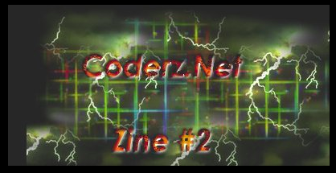
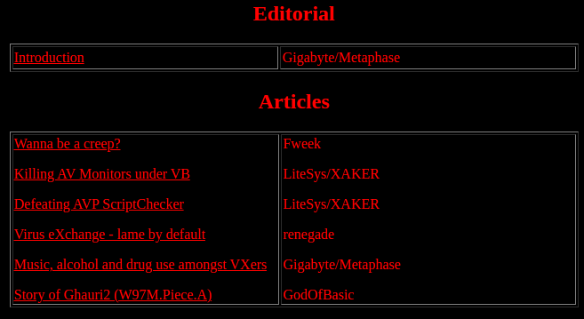
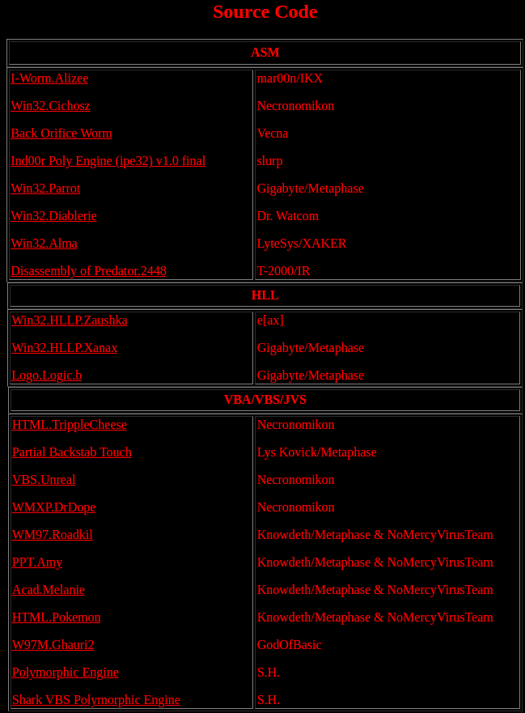
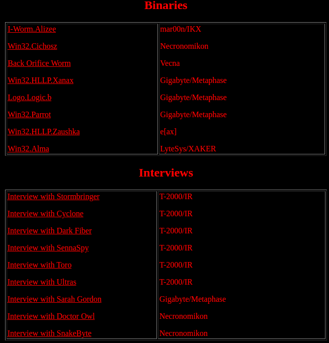

# Coderz EZine 2

## Editorial
- Introduction Gigabyte/Metaphase

## Articles
- Wanna be a creep? - Fweek
- Killing AV Monitors under VB - LiteSys/XAKER
- Defeating AVP ScriptChecker - LiteSys/XAKER
- Virus eXchange - lame by default - renegade
- Music, alcohol and drug use amongst VXers - Gigabyte/Metaphase
- Story of Ghauri2 (W97M.Piece.A) - GodOfBasic

## Source Code
### ASM

- I-Worm.Alizee - mar00n/IKX
- Win32.Cichosz - Necronomikon
- Back Orifice Worm - Vecna
- Ind00r Poly Engine (ipe32) v1.0 final - slurp
- Win32.Parrot - Gigabyte/Metaphase
- Win32.Diablerie - Dr. Watcom
- Win32.Alma - LyteSys/XAKER
- Disassembly of Predator.2448 - T-2000/IR

### HLL
- Win32.HLLP.Zaushka - e[ax]
- Win32.HLLP.Xanax - Gigabyte/Metaphase
- Logo.Logic.b - Gigabyte/Metaphase

### VBA/VBS/JVS
- HTML.TrippleCheese - Necronomikon
- Partial Backstab Touch - Lys Kovick/Metaphase
- VBS.Unreal - Necronomikon
- WMXP.DrDope - Necronomikon
- WM97.Roadkil - Knowdeth/Metaphase & NoMercyVirusTeam
- PPT.Amy - Knowdeth/Metaphase & NoMercyVirusTeam
- Acad.Melanie - Knowdeth/Metaphase & NoMercyVirusTeam
- HTML.Pokemon - Knowdeth/Metaphase & NoMercyVirusTeam
- W97M.Ghauri2 - GodOfBasic
- Polymorphic Engine - S.H.
- Shark VBS Polymorphic Engine - S.H.

### Binaries
- I-Worm.Alizee - mar00n/IKX
- Win32.Cichosz - Necronomikon
- Back Orifice Worm - Vecna
- Win32.HLLP.Xanax - Gigabyte/Metaphase
- Logo.Logic.b - Gigabyte/Metaphase
- Win32.Parrot - Gigabyte/Metaphase
- Win32.HLLP.Zaushka - e[ax]
- Win32.Alma - LyteSys/XAKER

## Interviews
- Interview with Stormbringer - T-2000/IR
- Interview with Cyclone - T-2000/IR
- Interview with Dark Fiber - T-2000/IR
- Interview with SennaSpy - T-2000/IR
- Interview with Toro - T-2000/IR
- Interview with Ultras - T-2000/IR
- Interview with Sarah Gordon - Gigabyte/Metaphase
- Interview with Doctor Owl - Necronomikon
- Interview with SnakeByte - Necronomikon

## Tools
- The Macintosh Macro Virus Kit - Knowdeth/Metaphase & NoMercyVirusTeam
- IIS XPLOIT MS01-033 v2 - Vecna
- Simple VBScript Virus Creator 1.0 - S.H.
- dasm - ring3 32 bit code disassembler - Lifewire/IKX
- hex AntiSocial Poly-Encryption Engine v1.0 - Lys Kovick/Metaphase
- RLEPack - ULTRAS/MATRiX
- The DOS Overwriting Kit 1.0a - GzR / [NuKE]
- Opcode Tracer - blueEbola

## Humor
- Virus-X making a fool out of himself at VX No Sleep Marathon: Kamehameha
Contributed by Gigabyte/Metaphase and Error/Team Necrosis, without Virus-X's permission, of course :)

- Virus-X making a fool out of himself at VX No Sleep Marathon: Kamehameha
Contributed by Gigabyte/Metaphase and Error/Team Necrosis, without Virus-X's permission, of course :)

