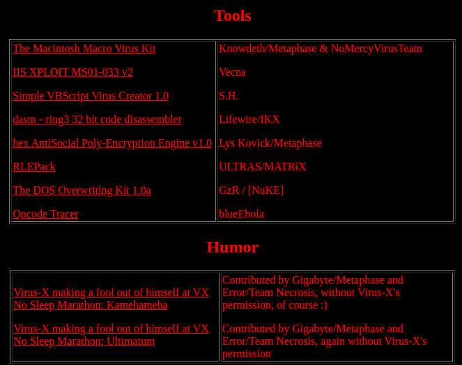

# Coderz EZine 2

```
Heya all,
Welcome to Coderz.Net Zine #2.
In November 2000, we released the first issue of Coderz.Net Zine. Now, a year later, after being delayed several times, and even almost canceled once, here is finally Coderz.Net Zine #2.
Several things have happened during the past year:

In late January, Coderz.Net went down for a while.
In March, Benny wrote Winux, the first virus that infects both Windows and Linux files.
In April, Coderz.Net was back online.
In May, the Sadmind worm which spreads itself between Solaris systems and defaces websites running unpatched IIS 4.0 and IIS 5.0 servers, spread globally.
In July, a worm called Code Red got even more widespread than Sadmind. This one spreads between unpatched IIS servers. Infected servers were supposed to flood www.whitehouse.gov, but administrators of the White House's site moved the site to avoid this.
Rumour has it T-2000 committed suicide on August 24th. T-2000, member of Immortal Riot, was the author of Kriz, Chainsaw, Messev, Gwar, Obsolete, Altar, Savior, and other viruses. He also contributed several things to this zine and the first issue of the zine. He was a great coder and we'll miss him.
Coderz.Net being a site, not a group, the zine wouldn't be possible without contributions. Thanks goes out to all people who sent us articles, viruses, tools and such. These people are:

Fweek, LiteSys, renegade, GodOfBasic, mar00n, Necronomikon, Vecna, slurp, Dr. Watcom, T-2000, e[ax], Lys Kovick, S.H., Knowdeth, Lifewire, ULTRAS, GzR, blueEbola

Thanks also goes out to:

Lifewire: For writing a tool to put the interviews in HTML a lot faster
People who filled in the  "Music, alcohol and drug use amongst VXers" survey
People who were interviewed
Greetings to:

Evul, darkman, Antistate Tortoise, Vecna, Knowdeth, ShadSeek, Raid, nucleii, Spanska, Roadkil, Error, jackie, Benny, Sinixtar, Raven, Lys Kovick, Painter6, Lifewire, Rajaat, Simon7, urgo32, LethalMind, and everyone else from Undernet #virus

I hope you enjoy reading this zine.

Gigabyte
```

## Editorial
- Introduction Gigabyte/Metaphase

## Articles
- Wanna be a creep? - Fweek
- Killing AV Monitors under VB - LiteSys/XAKER
- Defeating AVP ScriptChecker - LiteSys/XAKER
- Virus eXchange - lame by default - renegade
- Music, alcohol and drug use amongst VXers - Gigabyte/Metaphase
- Story of Ghauri2 (W97M.Piece.A) - GodOfBasic

## Source Code
### ASM

- I-Worm.Alizee - mar00n/IKX
- Win32.Cichosz - Necronomikon
- Back Orifice Worm - Vecna
- Ind00r Poly Engine (ipe32) v1.0 final - slurp
- Win32.Parrot - Gigabyte/Metaphase
- Win32.Diablerie - Dr. Watcom
- Win32.Alma - LyteSys/XAKER
- Disassembly of Predator.2448 - T-2000/IR

### HLL
- Win32.HLLP.Zaushka - e[ax]
- Win32.HLLP.Xanax - Gigabyte/Metaphase
- Logo.Logic.b - Gigabyte/Metaphase

### VBA/VBS/JVS
- HTML.TrippleCheese - Necronomikon
- Partial Backstab Touch - Lys Kovick/Metaphase
- VBS.Unreal - Necronomikon
- WMXP.DrDope - Necronomikon
- WM97.Roadkil - Knowdeth/Metaphase & NoMercyVirusTeam
- PPT.Amy - Knowdeth/Metaphase & NoMercyVirusTeam
- Acad.Melanie - Knowdeth/Metaphase & NoMercyVirusTeam
- HTML.Pokemon - Knowdeth/Metaphase & NoMercyVirusTeam
- W97M.Ghauri2 - GodOfBasic
- Polymorphic Engine - S.H.
- Shark VBS Polymorphic Engine - S.H.

### Binaries
- I-Worm.Alizee - mar00n/IKX
- Win32.Cichosz - Necronomikon
- Back Orifice Worm - Vecna
- Win32.HLLP.Xanax - Gigabyte/Metaphase
- Logo.Logic.b - Gigabyte/Metaphase
- Win32.Parrot - Gigabyte/Metaphase
- Win32.HLLP.Zaushka - e[ax]
- Win32.Alma - LyteSys/XAKER

## Interviews
- Interview with Stormbringer - T-2000/IR
- Interview with Cyclone - T-2000/IR
- Interview with Dark Fiber - T-2000/IR
- Interview with SennaSpy - T-2000/IR
- Interview with Toro - T-2000/IR
- Interview with Ultras - T-2000/IR
- Interview with Sarah Gordon - Gigabyte/Metaphase
- Interview with Doctor Owl - Necronomikon
- Interview with SnakeByte - Necronomikon

## Tools
- The Macintosh Macro Virus Kit - Knowdeth/Metaphase & NoMercyVirusTeam
- IIS XPLOIT MS01-033 v2 - Vecna
- Simple VBScript Virus Creator 1.0 - S.H.
- dasm - ring3 32 bit code disassembler - Lifewire/IKX
- hex AntiSocial Poly-Encryption Engine v1.0 - Lys Kovick/Metaphase
- RLEPack - ULTRAS/MATRiX
- The DOS Overwriting Kit 1.0a - GzR / [NuKE]
- Opcode Tracer - blueEbola

## Humor
- Virus-X making a fool out of himself at VX No Sleep Marathon: Kamehameha
Contributed by Gigabyte/Metaphase and Error/Team Necrosis, without Virus-X's permission, of course :)

- Virus-X making a fool out of himself at VX No Sleep Marathon: Kamehameha
Contributed by Gigabyte/Metaphase and Error/Team Necrosis, without Virus-X's permission, of course :)



